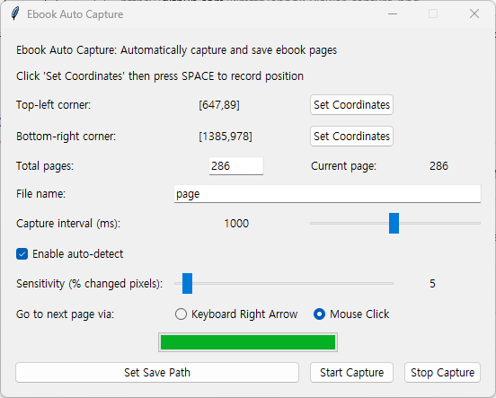

# 📖 Ebook Auto Capture

Automatically capture and save pages from any ebook viewer 📸✨  
Supports region selection, auto screen-change detection, and progress tracking.  
This script is a modified version of the original repository by [p0tat0-113](https://github.com/p0tat0-113/ebookAutoCapture).  

<p align="left">
  
</p>

## 🚀 Features

- 🖼️ Capture a selected screen region repeatedly
- ⚡ Auto-detect page changes with configurable sensitivity
- ⏱️ Adjustable interval between captures (in ms)
- ⌨️ Simulate next-page action using keyboard or mouse click
- 💾 Automatically name and save files
- 📊 Progress bar and page count tracking

## 🔧 How to Use

1. 🖱️ Select the top-left and bottom-right coordinates of the area you want to capture.
2. 📁 Set save directory and desired filename base.
3. 🔢 Enter total pages to capture.
4. 🔘 Choose auto-detect and next-page method if needed.
5. ▶️ Click **Start Capture** and relax!

## 📦 Requirements

- Python 3.x
- [`pyautogui`](https://pypi.org/project/pyautogui/)
- [`mss`](https://pypi.org/project/mss/)
- `numpy`, `tkinter` (usually built-in)

Install with:

```bash
pip install pyautogui mss numpy
```